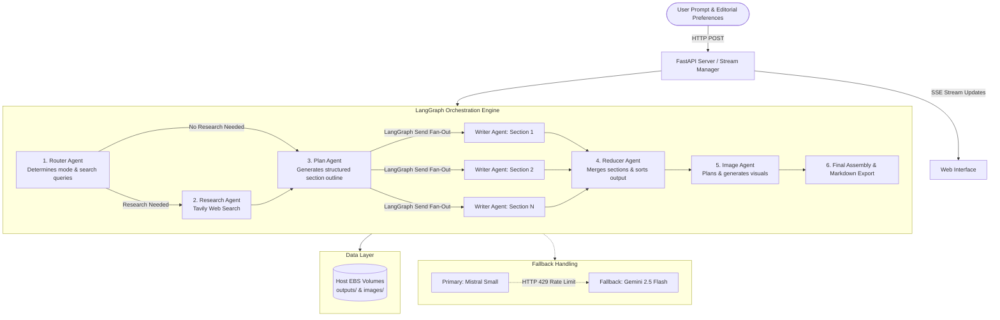

# AgentPress

A multi-agent long-form writing platform that researches, outlines, parallel-drafts, and illustrates technical writeups and essays using LangGraph, FastAPI, and Docker.

[Live Deployment](http://ec2-13-235-67-247.ap-south-1.compute.amazonaws.com:8001/) • [System Architecture](#system-architecture) • [Multi-Agent Pipeline](#multi-agent-pipeline) • [Features](#features) • [Tech Stack](#tech-stack) • [Getting Started](#getting-started-locally) • [API Reference](#api-reference)

---

## Live Deployment

The application is deployed and accessible at:

**Live URL:** [http://ec2-13-235-67-247.ap-south-1.compute.amazonaws.com:8001/](http://ec2-13-235-67-247.ap-south-1.compute.amazonaws.com:8001/)

Hosted on an AWS EC2 instance (`ap-south-1`) inside a Docker container, with continuous deployment managed via Amazon ECR and GitHub Actions.

---

## Overview

Generating long-form articles with a single LLM prompt often leads to repetitive phrasing, shallow reasoning, hallucinated facts, and slow sequential generation.

AgentPress structures the writing process as a coordinated multi-agent workflow. Built on LangGraph StateGraphs, it separates responsibilities across specialized agents:
- Categorizing whether real-time web research is required
- Retrieving and deduplicating authoritative sources
- Breaking the topic into a structured, granular section plan
- Drafting planned sections in parallel using a map-reduce pattern
- Generating inline conceptual visuals
- Assembling and formatting the final document

All execution updates, worker activities, and intermediate steps stream to the web client in real time via Server-Sent Events (SSE).

---

## System Architecture

The system consists of three main layers: the client interface, the FastAPI backend with streaming orchestration, and the LangGraph multi-agent execution graph with external APIs.



---

## Multi-Agent Pipeline

### 1. Router Agent
- Analyzes the input topic, target audience, and selected format.
- Classifies the topic into one of three execution modes:
  - `closed_book`: Conceptual or philosophical topics where web retrieval is unnecessary.
  - `hybrid`: Foundational topics requiring verification of recent developments or real-world examples.
  - `open_book`: Time-sensitive topics (industry news, recent model releases, current benchmarks).
- Generates 3 to 8 targeted web search queries when external information is needed.

### 2. Research Agent
- Executes search queries through the Tavily Search API.
- Cleans and deduplicates source URLs to prevent redundant references.
- Extracts key factual points and passes structured evidence items to the planning phase.
- Includes a direct extraction fallback to recover citations if structured parsing encounters token constraints.

### 3. Plan Agent (Orchestrator)
- Converts the research evidence and topic into a comprehensive blueprint of sections.
- Defines explicit requirements for each section: an evocative heading, a functional role (hook, argument, breakdown, reflection), target word count, and concrete narrative bullets.
- Uses Pydantic v2 field validators to normalize nested lists and irregular bullet formats emitted by the LLM.

### 4. Parallel Writer Agents (Map-Reduce)
- Dispatches section tasks to concurrent worker instances using LangGraph's dynamic `Send()` API.
- Each worker receives the section goal, bullet points, global outline context, evidence pack, and tone specifications.
- Emits real-time SSE progress events as individual sections finish drafting.

### 5. Reducer Agent
- Gathers completed sections through an `operator.add` reducer.
- Sorts sections deterministically according to the original plan order regardless of execution timing.
- Cleans transitions and constructs the unified document body.

### 6. Image Agent
- Identifies sections that benefit from visual explanation (e.g., conceptual comparisons, workflow diagrams).
- Invokes Google Gemini 2.5 Flash Image to generate illustrative assets.
- Stores generated images on the local filesystem and embeds references directly into the final markdown document.

---

## Features

- **Real-Time SSE Streaming:** Live progress updates, section completion statuses, and final markdown streamed over Server-Sent Events.
- **Immediate Execution Cancellation:** Frontend `AbortController` combined with backend generator cleanup stops active agent runs instantly upon user request.
- **Automatic 429 Rate-Limit Fallback:** If the primary LLM provider (Mistral Small) returns an HTTP 429 rate limit error at any step, execution automatically falls back to Google Gemini 2.5 Flash without failing the run.
- **Previous Writeups Library:** Saved writeups and metadata are indexed from disk, allowing users to browse, re-open, read, and export past articles from the sidebar.
- **Print and PDF Export:** Media print stylesheet formatted with A4 margins, orphan and widow controls, and page-break rules for clean PDF generation via the browser print dialog.
- **Editorial Controls:** Configurable format options (Explainer, Story, Tutorial), target audience selections, and tone settings passed directly into the planning prompt.
- **Reading Metrics and Syntax Highlighting:** Displays word counts, estimated read times, visual counts, and syntax-highlighted code blocks with individual copy buttons.

---

## Tech Stack

| Layer | Technologies |
| :--- | :--- |
| **Backend Framework** | Python 3.12, FastAPI, Uvicorn |
| **Agent Orchestration** | LangGraph, LangChain Core |
| **Language Models** | Mistral Small (`mistralai:mistral-small-latest`), Google Gemini 2.5 Flash (`google_genai:gemini-2.5-flash`) |
| **Multimodal Generation** | Google Gemini 2.5 Flash Image (`gemini-2.5-flash-image`) |
| **Search Engine** | Tavily Search API |
| **Data Validation** | Pydantic v2 |
| **Frontend** | Vanilla JavaScript (ES6+), HTML5, CSS3, Marked.js, Highlight.js, DOMPurify |
| **Containerization** | Docker |
| **Cloud Infrastructure** | AWS EC2 (Ubuntu), Amazon Elastic Container Registry (ECR) |
| **CI/CD** | GitHub Actions |

---

## Project Structure

```text
AgentPress/
├── app.py                     # FastAPI application, SSE streaming routes, and REST endpoints
├── backend.py                 # LangGraph StateGraph, agent nodes, and Pydantic models
├── Dockerfile                 # Docker container build definition
├── .dockerignore              # Docker build exclusions
├── requirements.txt           # Python dependencies
├── .env.example               # Example environment configuration
├── .github/
│   └── workflows/
│       └── deploy.yml         # GitHub Actions deployment workflow
├── static/
│   ├── css/
│   │   └── style.css          # UI layout, typography, animations, and print styles
│   └── js/
│       └── app.js             # Client logic, SSE connection, DOM updates, and library handling
├── templates/
│   └── index.html             # Main interface template
├── outputs/                   # Directory for generated markdown files and metadata
└── images/                    # Directory for generated images
```

---

## Getting Started Locally

### Prerequisites

- Python 3.12+
- API keys for:
  - `MISTRAL_API_KEY` (Mistral AI)
  - `GOOGLE_API_KEY` or `GEMINI_API_KEY` (Google AI Studio)
  - `TAVILY_API_KEY` (Tavily Search)

### 1. Clone the Repository

```bash
git clone https://github.com/PrathmeshRanjan/AgentPress.git
cd AgentPress
```

### 2. Configure Environment Variables

Copy the sample environment file:

```bash
cp .env.example .env
```

Set your API keys inside `.env`:

```env
MISTRAL_API_KEY=your_mistral_api_key
GOOGLE_API_KEY=your_gemini_api_key
TAVILY_API_KEY=your_tavily_api_key
```

### 3. Create Virtual Environment and Install Dependencies

```bash
python3 -m venv .venv
source .venv/bin/activate
pip install --upgrade pip
pip install -r requirements.txt
```

### 4. Run the Server

```bash
python app.py
```

Access the application at `http://localhost:8000`.

---

## Running with Docker

Build and run the containerized application locally:

```bash
# Build the image
docker build -t agentpress:latest .

# Run container with volume mounts for outputs and images
docker run -d \
  --name agentpress \
  -p 8000:8000 \
  --env-file .env \
  -v $(pwd)/outputs:/app/outputs \
  -v $(pwd)/images:/app/images \
  agentpress:latest
```

---

## API Reference

### Execution Endpoint
- **`POST /api/run`**
  - Starts the workflow and returns a Server-Sent Events stream.
  - Request body:
    ```json
    {
      "topic": "Comparative analysis of Kafka and Dostoevsky",
      "genre": "explainer",
      "audience": "General Readers",
      "tone": "Analytical & Rigorous"
    }
    ```
  - Response stream events:
    - `stage`: Lifecycle updates for router, research, planning, writing, and reducer phases.
    - `section_complete`: Emitted when an individual worker finishes a section.
    - `final`: Contains completed markdown, run ID, and download link.
    - `error`: Error details if an unhandled failure occurs.

### History and Management Endpoints
- **`GET /api/history`**: Lists past generated writeups with run IDs, titles, word counts, read times, and creation dates.
- **`GET /api/runs/{run_id}`**: Returns the full markdown document and metadata for the requested run ID.
- **`DELETE /api/runs/{run_id}`**: Deletes the run directory and associated assets from disk.
- **`GET /api/runs/{run_id}/download`**: Downloads the generated markdown file directly.
- **`GET /api/health`**: Returns system health status and workflow compilation state.

---

## Deployment Pipeline

Deployment is automated through GitHub Actions upon every push to the `main` branch:

1. **Build & Authenticate:** The runner builds the Docker image and logs into Amazon ECR using AWS credentials.
2. **Push:** The tagged image is pushed to the private Amazon ECR repository.
3. **Deploy over SSH:** The workflow connects to the EC2 host via SSH, prunes dangling images to preserve disk space, pulls the latest image, and restarts the container with volume mounts for persistent data (`outputs/` and `images/`).

---

## License

This project is licensed under the MIT License. See `LICENSE` for details.
