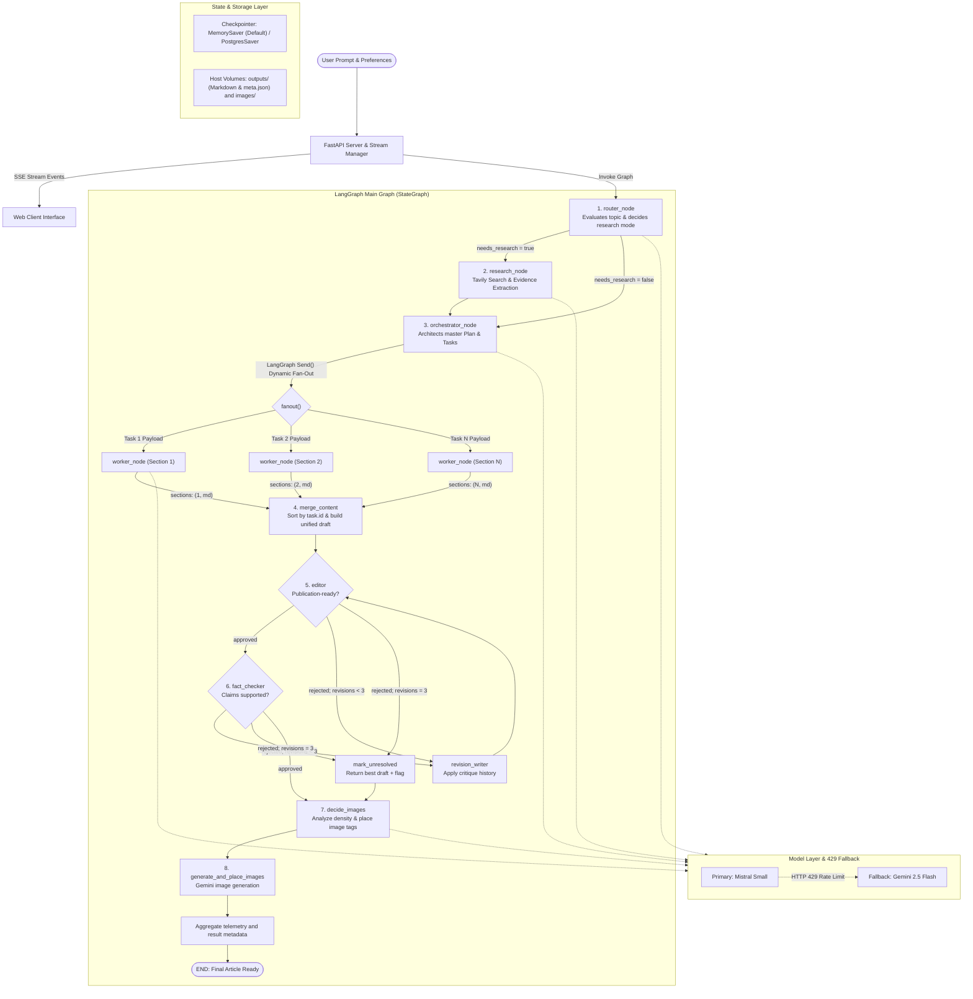

# AgentPress

A multi-agent long-form writing platform that researches, outlines, parallel-drafts, reviews, fact-checks, and illustrates long-form content using LangGraph, FastAPI, and Docker. The project includes a completed, telemetry-backed benchmark against a one-shot LLM baseline—not just an architecture demo.

[Benchmark Results](#benchmark-results-primary-evidence) • [Live Deployment](http://ec2-13-235-67-247.ap-south-1.compute.amazonaws.com:8001/) • [Architecture Overview](#architecture-overview) • [Backend Architecture (`backend.py`)](#backend-architecture-backendpy) • [Review Loop Deep Dive](#review-loop-deep-dive) • [Observability](#observability-and-benchmarking) • [Getting Started](#getting-started-locally)

---

## Benchmark Results: Primary Evidence

AgentPress was benchmarked against a single, well-prompted LLM baseline across **three completed paired topics**. Both approaches used the same model fallback chain and matched output targets; web research and image generation were disabled to isolate the cost of multi-agent orchestration.

| System | Average Latency | Total Tokens | Total Estimated Cost | Average Revision Loops |
|---|---:|---:|---:|---:|
| Vanilla Baseline | **13,417 ms** | **6,205** | **$0.0148** | 0.00 |
| Multi-Agent Pipeline | 56,791 ms | 47,602 | $0.0778 | **0.67** |

### What the measurements show

- The multi-agent pipeline used **667.2% more tokens**, took **323.3% longer**, and cost **426.3% more** than the one-shot baseline.
- Two of three topics triggered a real Writer revision after review; all three passed the final Editor and Fact-Checker gates.
- No run reached the unresolved-error circuit breaker.
- The benchmark makes the orchestration trade-off explicit: higher cost and latency buy structured planning, parallel drafting, critique memory, revision, and independent factual review. It does **not** claim an automatic quality improvement without human scoring.

### Stored benchmark evidence and reports

All generated benchmark artifacts are checked into the repository for inspection and comparison:

- **[Aggregate benchmark report](BENCHMARK_REPORT.md):** methodology, aggregate/per-topic metrics, overhead calculations, revision counts, and resume-ready bullets.
- **[Blinded A/B comparison report](BENCHMARK_OUTPUTS.md):** complete outputs shown as System A/System B with a 25-point human rubric for accuracy, coherence, depth, clarity, and usefulness.
- **[Raw benchmark telemetry](benchmark_results.jsonl):** machine-readable prompts, outputs, per-agent invocation metrics, token counts, latency, model identity, estimated cost, and final metadata for every completed pair.

The benchmark profile targets two ~300-word pipeline sections, a matched baseline length, and at most one benchmark revision to conserve API quota. The production workflow still enforces its full three-revision circuit breaker.

---

## Live Deployment

The application is deployed and accessible at:

**Live URL:** [http://ec2-13-235-67-247.ap-south-1.compute.amazonaws.com:8001/](http://ec2-13-235-67-247.ap-south-1.compute.amazonaws.com:8001/)

Hosted on an AWS EC2 instance (`ap-south-1`) inside a Docker container, with continuous deployment managed via Amazon ECR and GitHub Actions.

---

## Architecture Overview

AgentPress separates responsibilities across specialized nodes in a LangGraph StateGraph, using dynamic worker fan-out for drafting, bounded editorial feedback cycles, factual review, and final image placement.



After section assembly, the root graph runs an Editor and Fact-Checker gate. A rejection appends structured critique to `feedback_history` and routes the draft through `revision_writer` before it is reviewed again. `revision_count` permits at most three revisions; a further rejection trips `mark_unresolved`, returns the highest-scoring reviewed draft, and sets `metadata.unresolved_errors=true`.

Every agent/node invocation emits provider-normalized latency, input tokens, output tokens, estimated USD cost, model identity, and status. Parallel Writer events are merged through an annotated state reducer. The final SSE JSON, saved run metadata, and direct graph result all include both per-invocation events and end-to-end totals.

---

## Backend Architecture (`backend.py`)

The core execution engine is defined entirely within `backend.py`. It uses LangGraph to manage state, routing, concurrency, and sub-pipeline execution.

### 1. State Definition (`State`)
The state channel uses a Python `TypedDict` for lightweight runtime updates without schema overhead:
```python
class State(TypedDict):
    topic: str
    mode: str
    needs_research: bool
    queries: List[str]
    evidence: List[EvidenceItem]
    plan: Optional[Plan]
    sections: Annotated[List[tuple[int, str]], operator.add]
    merged_md: str
    md_with_placeholders: str
    image_specs: List[dict]
    final: str
    revision_count: int
    feedback_history: Annotated[List[dict], operator.add]
    unresolved_errors: bool
    telemetry_events: Annotated[List[dict], operator.add]
    telemetry: dict
    result: dict
```
- **`sections` Channel:** Decorated with `Annotated[..., operator.add]` so parallel workers can asynchronously append section tuples `(task.id, section_markdown)` without state collision or race conditions.
- **`plan` Channel:** Stores the structured editorial blueprint created by the orchestrator.
- **`feedback_history` and `revision_count`:** Carry critiques across cycles and enforce the hard stop.
- **`telemetry_events`:** Uses the same reducer pattern to merge metrics from parallel Writer invocations safely.

---

### 2. Execution Flow & Nodes

#### A. Router Node (`router_node`)
- Analyzes the requested topic, audience, and editorial style using `model.with_structured_output(RouterDecision)`.
- Categorizes the execution path:
  - `closed_book`: Conceptual or philosophical subjects where web retrieval is unnecessary.
  - `hybrid`: Foundational subjects requiring fresh real-world examples, recent releases, or benchmarks.
  - `open_book`: Time-sensitive topics (industry news, current pricing, recent events).
- Generates 3 to 8 targeted, time-aware search queries if research is required.
- Dynamic branching via `route_next`:
  ```python
  def route_next(state: State) -> Literal["research", "orchestrator"]:
      return "research" if state.get("needs_research") else "orchestrator"
  ```

#### B. Research Node (`research_node`)
- Queries the Tavily Search API concurrently across all generated queries.
- Normalizes and deduplicates source URLs to prevent redundant citations.
- Extracts structured evidence items using `model.with_structured_output(EvidencePack)`.
- Includes a direct extraction fallback: if structured parsing encounters token constraints, raw search snippets are transformed into `EvidenceItem` records directly.

#### C. Orchestrator Node (`orchestrator_node`)
- Converts evidence and topic requirements into a master `Plan`.
- Breaks the writeup into sequential `Task` objects, assigning each section an evocative heading, a functional role (`hook`, `argument`, `breakdown`, `reflection`), target word count (150–550 words), and concrete narrative bullets.
- Enforces narrative cohesion across the entire article outline before writing begins.

#### D. Parallel Worker Node (`worker_node`) & Fan-Out
- Dispatches sections using LangGraph's dynamic `Send()` API inside `fanout`:
  ```python
  def fanout(state: State):
      plan = state["plan"]
      return [
          Send("worker", {
              "task": task.model_dump(),
              "plan": plan.model_dump(),
              "evidence": [e.model_dump() for e in state.get("evidence", [])],
              "topic": state["topic"],
              "mode": state.get("mode", "closed_book"),
          })
          for task in plan.tasks
      ]
  ```
- Each `worker_node` executes in parallel with access to the global outline, evidence pack, target words, and strict anti-slop prompt guidelines (forbidding generic AI filler words like "delve", "testament", "tapestry", "landscape", "in conclusion").
- Returns `{"sections": [(task.id, section_md)]}`.

---

## Review Loop Deep Dive

A major feature of `backend.py` is its bounded cyclic review path. Editorial and factual rejection both route to the full-draft Writer, and every rejection remains available in state:

```python
def route_after_editor(state):
    if state.get("editor_approved", False):
        return "fact_checker"
    if state.get("revision_count", 0) >= MAX_REVISIONS:
        return "unresolved"
    return "revision_writer"
```

### Post-Draft Pipeline Stages:

1. **`merge_content` (Deterministic Sorting & Assembly)**
   - Reads the accumulated `sections` list of tuples `(task.id, section_markdown)`.
   - Sorts strictly by `task.id`:
     ```python
     ordered_sections = [md for _, md in sorted(state["sections"], key=lambda x: x[0])]
     ```
   - Eliminates out-of-order race conditions from asynchronous workers and prefixes the master title.

2. **`editor` and `fact_checker` (Structured Quality Gates)**
   - Emit `ReviewDecision` objects with approval, score, and actionable critique.
   - Append rejected feedback to `feedback_history` and route through `revision_writer`.
   - Preserve the highest Editor-scored draft for graceful circuit-breaker output.

3. **`decide_images` (Contextual Visual Planning)**
   - Analyzes the full assembled markdown draft.
   - Emits a structured `GlobalImagePlan` proposing up to 3 high-impact visual assets.
   - Identifies exact contextual paragraphs and injects image placeholder tags (`[[IMAGE_1]]`, `[[IMAGE_2]]`, `[[IMAGE_3]]`) on their own lines.

4. **`generate_and_place_images` (Multimodal Synthesis & Fallback)**
   - Iterates over planned image specifications and calls **Google Gemini 2.5 Flash Image** (`gemini-2.5-flash-image`).
   - Cleans filenames, writes image binaries to `images/<safe_filename>.png`, and substitutes the placeholder tags with markdown image syntax.
   - **Graceful Fallback:** If image generation hits rate limits, invalid credentials, or network errors, automatically injects a styled editorial callout box instead of failing the pipeline:
     ```markdown
     > 🖼️ **[Visual Note]** Caption details...
     >
     > *Alt:* Description of the concept...
     >
     > *Illustration Concept:* Generative visual prompt...
     ```

---

## Data Contracts and Validation

All LLM structured outputs in `backend.py` use strict Pydantic v2 models with custom `@field_validator(mode="before")` pre-processors to prevent schema failures:

- **`Task`:** Represents an individual section. Features `sanitize_bullets` to automatically flatten nested lists or dictionary structures emitted by LLMs into a clean `List[str]`.
- **`Plan`:** The master blueprint containing the title, audience, tone, genre, constraints, and ordered tasks. Features `sanitize_constraints`.
- **`RouterDecision`:** Routing verdict (`needs_research`, `mode`, `queries`). Features `sanitize_queries`.
- **`EvidenceItem` & `EvidencePack`:** Structured search facts containing `title`, `url`, `snippet`, and `published_at`.
- **`ImageSpec` & `GlobalImagePlan`:** Image placement blueprint containing placeholder tags, generative prompts, captions, and size configurations.

---

## Resilience and Fault Tolerance

### 1. Transparent 429 Rate-Limit Fallback
To protect against provider rate limits (`429 Too Many Requests`), `backend.py` uses LangChain's `RunnableWithFallbacks`:
```python
primary_model = init_chat_model("mistralai:mistral-small-latest")

try:
    gemini_fallback = init_chat_model("google_genai:gemini-2.5-flash")
    model = primary_model.with_fallbacks([gemini_fallback])
except Exception:
    model = primary_model
```
If Mistral Small hits rate limits at any stage (router, research extractor, orchestrator, workers, or image planner), execution automatically fails over to Google Gemini 2.5 Flash without throwing an exception or interrupting streaming.

### 2. Dual Checkpointer Architecture
- **MemorySaver (Default):** In-memory checkpointer optimized for real-time FastAPI streaming. Eliminates database connection timeouts, SSL drops, and connection pool exhaustion.
- **PostgresSaver:** Optional persistent checkpointer supported via `psycopg_pool.ConnectionPool` for environments requiring durable checkpoints across server restarts.

### 3. Environment Variable Sanitization
On startup, `backend.py` automatically strips extraneous single quotes, double quotes, and trailing whitespace from API keys loaded via Docker `--env-file`.

### 4. Bounded Review Cycles

Editor or Fact-Checker rejection routes the draft back to the revision Writer with the complete critique history. After three revisions, a circuit breaker stops the graph and returns the best reviewed draft with explicit unresolved-error metadata instead of continuing to burn tokens.

---

## Observability and Benchmarking

Run the reproducible benchmark (image generation and research are disabled for an apples-to-apples text comparison):

```bash
python benchmark.py
python generate_report.py
```

If a provider quota interrupts a suite, rerun the same command with `--resume`; completed topics are retained and only unfinished seeds run again.

For a token-efficient quality pass, use the compact profile:

```bash
python benchmark.py --limit 3 --sections 2 --section-words 300 --max-revisions 1
```

This compares matched ~600-word outputs, disables research and images, and retains independent planning, section writing, editorial review, and fact-checking calls.

The completed three-topic results are highlighted at the top of this README. Use the generated aggregate report and blinded A/B report to inspect the measurements and compare content quality directly.

The benchmark produces:

- `benchmark_results.jsonl`: machine-readable output, per-agent telemetry, and paired metrics.
- `BENCHMARK_OUTPUTS.md`: complete baseline and multi-agent outputs side-by-side for human review.
- `BENCHMARK_REPORT.md`: aggregate latency, token, cost, revision-loop metrics, and evidence-backed resume bullets.

Token prices are centralized in `telemetry.py`. The checked-in defaults use standard paid-tier rates of $0.15/$0.60 per million input/output tokens for Mistral Small, $0.30/$2.50 for Gemini 2.5 Flash, and $0.30 input plus $30.00 per million image-output tokens for Gemini 2.5 Flash Image; update the table when provider pricing changes.

---

## Tech Stack

| Layer | Technologies |
| :--- | :--- |
| **Backend Framework** | Python 3.12, FastAPI, Uvicorn |
| **Agent Orchestration** | LangGraph (StateGraph, bounded feedback cycles, Send Fan-Out), LangChain Core |
| **Language Models** | Mistral Small (`mistralai:mistral-small-latest`), Google Gemini 2.5 Flash (`google_genai:gemini-2.5-flash`) |
| **Multimodal Generation** | Google Gemini 2.5 Flash Image (`gemini-2.5-flash-image`) |
| **Search Engine** | Tavily Search API |
| **Data Validation** | Pydantic v2 |
| **State Persistence** | MemorySaver, PostgresSaver (optional via `psycopg_pool`) |
| **Frontend** | Vanilla JavaScript (ES6+), HTML5, CSS3, Marked.js, Highlight.js, DOMPurify |
| **Containerization** | Docker |
| **Cloud Infrastructure** | AWS EC2 (Ubuntu), Amazon Elastic Container Registry (ECR) |
| **CI/CD** | GitHub Actions |

---

## Getting Started Locally

### Prerequisites
- Python 3.12+
- API keys for `MISTRAL_API_KEY`, `GOOGLE_API_KEY` (or `GEMINI_API_KEY`), and `TAVILY_API_KEY`.

### 1. Clone the Repository
```bash
git clone https://github.com/PrathmeshRanjan/AgentPress.git
cd AgentPress
```

### 2. Configure Environment Variables
```bash
cp .env.example .env
```
Populate your API keys inside `.env`:
```env
MISTRAL_API_KEY=your_mistral_api_key
GOOGLE_API_KEY=your_gemini_api_key
TAVILY_API_KEY=your_tavily_api_key
```

### 3. Create Virtual Environment & Install Dependencies
```bash
python3 -m venv .venv
source .venv/bin/activate
pip install --upgrade pip
pip install -r requirements.txt
```

### 4. Run Application
```bash
python app.py
```
Open `http://localhost:8000` in your browser.

---

## Running with Docker

```bash
# Build the Docker image
docker build -t agentpress:latest .

# Run with persistent volume mounts
docker run -d \
  --name agentpress \
  -p 8000:8000 \
  --env-file .env \
  -v $(pwd)/outputs:/app/outputs \
  -v $(pwd)/images:/app/images \
  agentpress:latest
```

---

## API Reference

- **`POST /api/run`**: Starts workflow execution and returns a real-time Server-Sent Events stream of stage updates, section completions, and the final deliverable.
- **`GET /api/history`**: Lists completed writeups indexed from persistent disk storage.
- **`GET /api/runs/{run_id}`**: Retrieves markdown and metadata for a specific writeup.
- **`DELETE /api/runs/{run_id}`**: Deletes a writeup and its local assets from disk.
- **`GET /api/runs/{run_id}/download`**: Direct download of the completed markdown file.
- **`GET /api/health`**: Returns server status and LangGraph compilation state.
