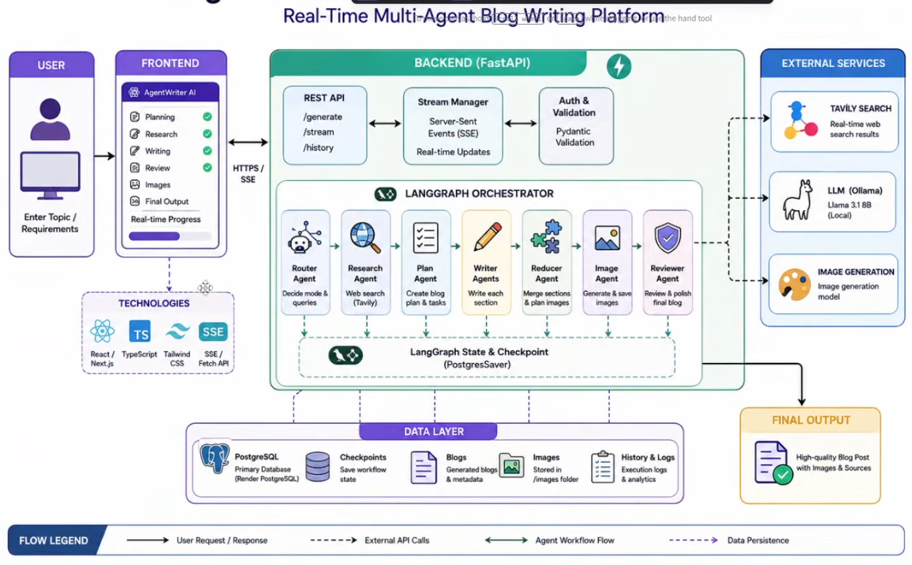
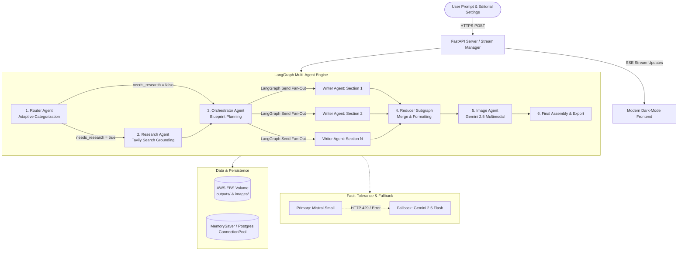

# ✦ AgentPress — Autonomous Multi-Agent Editorial Studio

<div align="center">

[](https://python.org)
[](https://fastapi.tiangolo.com)
[](https://langchain-ai.github.io/langgraph/)
[](https://www.docker.com)
[](https://aws.amazon.com)
[](https://github.com/features/actions)

<br/>

**A production-grade, real-time autonomous multi-agent publishing platform that researches, architects, parallel-drafts, and illustrates long-form technical writeups and editorial essays.**

[🌐 Live Production Demo](http://ec2-13-235-67-247.ap-south-1.compute.amazonaws.com:8001/) • [🏗️ Architecture Overview](#-system-architecture) • [⚡ Key Features](#-key-features) • [🚀 Quickstart](#-getting-started-locally)

</div>

---

## 🌟 Live Production Deployment

AgentPress is fully deployed and accessible in production:

> 🔗 **Live URL:** [http://ec2-13-235-67-247.ap-south-1.compute.amazonaws.com:8001/](http://ec2-13-235-67-247.ap-south-1.compute.amazonaws.com:8001/)
> 
> *Hosted on AWS EC2 (`ap-south-1`) via containerized Docker architecture, with continuous deployment orchestrated through Amazon ECR and GitHub Actions.*

---

## 📖 Executive Summary

Writing comprehensive, authoritative long-form content (3,000+ words) with standard LLM chat interfaces frequently suffers from context window saturation, shallow reasoning, hallucinated citations, and linear generation bottlenecks.

**AgentPress** solves this by treating long-form publication as a **distributed, multi-agent software engineering problem**. Built on **LangGraph StateGraphs**, AgentPress orchestrates specialized AI agents that dynamically categorize research needs, ground facts via real-time web search, architect structured section blueprints, fan out parallel drafting workers, and synthesize multimodal imagery—all streamed live to the client via Server-Sent Events (SSE).

---

## 🏗️ System Architecture



The platform follows an asynchronous, event-driven client-server architecture split into three decoupled tiers:



---

## 🤖 The Multi-Agent Pipeline

### 1. 🧭 Router Agent (Adaptive Topic Categorization)
- **Role:** Evaluates the user's topic, target audience, and desired format.
- **Classification Modes:**
  - `closed_book`: Evergreen principles, philosophical analyses, or creative narratives that do not require live web data.
  - `hybrid`: Foundational subjects requiring fresh real-world benchmarks, recent tool releases, or modern case studies.
  - `open_book`: Time-sensitive topics (industry news roundups, current pricing models, recent regulatory shifts).
- **Output:** If research is required, generates 3–8 targeted, high-signal search queries.

### 2. 🌐 Research Agent (Authoritative Search & Deduplication)
- **Role:** Executes search queries against the **Tavily Search API**, filters noise, and extracts structured evidence.
- **Deduplication:** Normalizes source URLs and deduplicates records to ensure citations are unique and primary.
- **Resilient Fallback:** Automatically reconstructs `EvidenceItem` citations directly from raw payloads if structured LLM extraction hits context limits.

### 3. 📐 Orchestrator Agent (Master Blueprint Planning)
- **Role:** Deconstructs the topic into an ordered blueprint of sections.
- **Granular Contracts:** Each section task defines an evocative title, functional section role (`hook`, `argument`, `breakdown`, `reflection`), specific 1-sentence goal, target word count (150–550 words), and 3–6 concrete narrative bullet points.
- **Pydantic Validation:** Features automatic schema interceptors that flatten nested bullet arrays emitted by LLMs, guaranteeing 100% schema compliance.

### 4. ✍️ Parallel Writer Agents (LangGraph Map-Reduce / Fan-Out)
- **Role:** Drafts each planned section concurrently using LangGraph's dynamic `Send()` API.
- **Deterministic Reducer:** Uses `operator.add` to accumulate completed sections as `(task.id, section_markdown)` tuples, sorting deterministically regardless of which worker completes first.
- **Context Injection:** Each worker receives the global outline, evidence pack, tone guidelines, and previous section context to ensure seamless transitions.

### 5. 🎨 Multimodal Image Agent (Generative Visuals & Placement)
- **Role:** Evaluates narrative density and designs visual aids (architectural diagrams, conceptual dualism comparisons, visual notes).
- **Generation:** Queries **Google Gemini 2.5 Flash Image** (`gemini-2.5-flash-image`) to synthesize high-resolution inline visuals.
- **Local Caching & Fallback:** Stores generated PNGs under `/images/`. If image generation encounters rate limits or missing credentials, embeds an elegant editorial visual note instead of failing the pipeline.

---

## ⚡ Key Features

| Feature | Description |
| :--- | :--- |
| **Real-Time SSE Streaming** | Live terminal-style execution timeline showing step-by-step agent activities, progress metrics, and live section completion. |
| **Dual Stop Execution Controls** | Instant execution cancellation via `AbortController` and backend `GeneratorExit` handlers that halt LLM processing immediately. |
| **Zero-Downtime 429 Fallback** | Automatic model switching: if the primary provider (Mistral Small) hits a `429 Too Many Requests` rate limit, LangChain's `RunnableWithFallbacks` transparently reroutes to Google Gemini 2.5 Flash. |
| **Sidebar History & Library** | Persistent past writeup library stored on host volumes. Browse, preview, and re-open previously generated writeups with 1 click. |
| **Publication-Grade Print/PDF** | Dedicated `@media print` CSS engine with A4 margins, orphan/widow protection, high-contrast typography, and page-break rules. |
| **Editorial Pill Controls** | Intuitive inline toolbar to customize writeup format (Explainer, Story, Tutorial), audience (Founders, Engineers, Learners), and voice/tone. |
| **Reading Statistics & Code Copy** | Real-time calculation of word count, estimated reading time, visual count, and syntax-highlighted code blocks with 1-click copy buttons. |

---

## 🛠️ Technology Stack

### Backend & AI Core
- **Language:** Python 3.12 (Modern type hinting, `asyncio`, typing schemas)
- **Framework:** [FastAPI](https://fastapi.tiangolo.com) (High-performance ASGI server with SSE streaming)
- **Orchestration:** [LangGraph](https://langchain-ai.github.io/langgraph/) (StateGraph, Send fan-out, Subgraphs, MemorySaver)
- **LLM Integrations:**
  - Primary: [Mistral Small](https://mistral.ai) (`mistralai:mistral-small-latest`)
  - Fallback & Multimodal: [Google Gemini 2.5 Flash](https://ai.google.dev) (`google_genai:gemini-2.5-flash` & `gemini-2.5-flash-image`)
- **Web Search Engine:** [Tavily Search API](https://tavily.com)
- **Validation:** [Pydantic v2](https://docs.pydantic.dev/) (Strict schemas, `field_validator` hooks)

### Frontend & Styling
- **Markup & Templates:** Semantic HTML5 with Jinja2 Templating
- **Styling:** Custom Vanilla CSS3 (CSS Grid, Flexbox, Glassmorphism, CSS Variables, `@media print` stylesheets)
- **Markdown & Highlighting:** Marked.js (GFM), Highlight.js (GitHub Dark Dimmed theme), DOMPurify (XSS Sanitization)

### Cloud, DevOps & Infrastructure
- **Containerization:** Docker (Multi-layer caching, non-root slim runtime)
- **Container Registry:** Amazon Elastic Container Registry (Amazon ECR)
- **Cloud Hosting:** Amazon Web Services (AWS EC2 - Ubuntu in `ap-south-1`)
- **CI/CD:** GitHub Actions (Automated build, test, ECR push, SSH hot-deploy with pre-pull image pruning)
- **Data Persistence:** AWS EBS Host Volume Mounts (`~/agentpress-data/outputs`, `~/agentpress-data/images`)

---

## 📂 Project Structure

```text
AgentPress/
├── app.py                     # FastAPI application, SSE stream manager & REST endpoints
├── backend.py                 # LangGraph StateGraph, multi-agent nodes & Pydantic schemas
├── Dockerfile                 # Production container build specification
├── .dockerignore              # Optimized Docker build context exclusions
├── requirements.txt           # Production Python dependencies
├── .env.example               # Environment configuration template
│
├── .github/
│   └── workflows/
│       └── deploy.yml         # GitHub Actions automated CI/CD deployment pipeline
│
├── static/
│   ├── css/
│   │   └── style.css          # Studio styling, animations, responsive grid & print rules
│   └── js/
│       └── app.js             # Reactive frontend, SSE consumer, tab switching & history logic
│
├── templates/
│   └── index.html             # Main Studio interface, composer, timeline & preview canvas
│
├── outputs/                   # Persistent storage for generated Markdown and meta.json
└── images/                    # Persistent storage for generated multimodal illustrations
```

---

## 🚀 Getting Started Locally

### Prerequisites
- **Python 3.12+**
- Active API keys for:
  - `MISTRAL_API_KEY` (from [Mistral Console](https://console.mistral.ai/))
  - `GOOGLE_API_KEY` or `GEMINI_API_KEY` (from [Google AI Studio](https://aistudio.google.com/))
  - `TAVILY_API_KEY` (from [Tavily Search](https://tavily.com/))

### 1. Clone the Repository
```bash
git clone https://github.com/PrathmeshRanjan/AgentPress.git
cd AgentPress
```

### 2. Configure Environment Variables
Create a `.env` file in the root directory:
```bash
cp .env.example .env
```

Populate your keys:
```env
MISTRAL_API_KEY=your_mistral_api_key
GOOGLE_API_KEY=your_gemini_api_key
TAVILY_API_KEY=your_tavily_api_key
```

### 3. Setup Virtual Environment
```bash
python3 -m venv .venv
source .venv/bin/activate
pip install --upgrade pip
pip install -r requirements.txt
```

### 4. Run the Application
```bash
python app.py
```
Open your browser at **`http://localhost:8000`**.

---

## 🐳 Running with Docker

Build and run the container locally:

```bash
# Build the Docker image
docker build -t agentpress:latest .

# Run with persistent volume mounts
docker run -d \
  --name agentpress \
  -p 8000:8000 \
  --env-file .env \
  -v $(pwd)/outputs:/app/outputs \
  -v $(pwd)/images:/app/images \
  agentpress:latest
```

---

## 📡 REST & Streaming API Reference

### 1. Stream Execution
- **`POST /api/run`**
  - **Body:**
    ```json
    {
      "topic": "The cognitive dissonance of social media algorithms",
      "genre": "explainer",
      "audience": "Developers & Architects",
      "tone": "Analytical, rigorous and data-backed"
    }
    ```
  - **Response:** `text/event-stream` (Server-Sent Events) streaming phase updates, section completions, and final deliverable payload.

### 2. Library & History
- **`GET /api/history`**: Returns a list of past generated writeups with title, word counts, and timestamps.
- **`GET /api/runs/{run_id}`**: Retrieves the full markdown writeup and metadata for a specific run.
- **`DELETE /api/runs/{run_id}`**: Permanently removes a writeup and associated assets from storage.
- **`GET /api/runs/{run_id}/download`**: Direct download of the completed `.md` document.

### 3. System Health
- **`GET /api/health`**: Returns `{"status": "ok", "workflow": "loaded"}` confirming LangGraph compilation status.

---

## 🛡️ Robustness & Production Engineering

1. **Self-Healing LLM Rate-Limit Fallback:**
   Rate limits (`429 Too Many Requests`) from third-party AI APIs can cripple linear generation pipelines. AgentPress implements `RunnableWithFallbacks` to seamlessly route prompts to Gemini 2.5 Flash without halting workflows.
2. **Docker `--env-file` Sanitization:**
   Automatically cleanses and strips accidental surrounding quotes (`'` or `"`) and carriage returns from environment variables passed through container runtimes.
3. **Map-Reduce Concurrency:**
   Section drafting scales horizontally across parallel LangGraph workers, reducing total generation time from minutes to seconds.
4. **Volume Mount Persistence:**
   All deliverables and image assets are written to mounted host volumes, ensuring that zero data is lost across container rebuilds or CI/CD redeployments.

---

## 📄 License

Distributed under the **MIT License**. See `LICENSE` for more information.

---

<div align="center">
  Crafted with ❤️ by <a href="https://github.com/PrathmeshRanjan">Prathmesh Ranjan</a>
</div>
