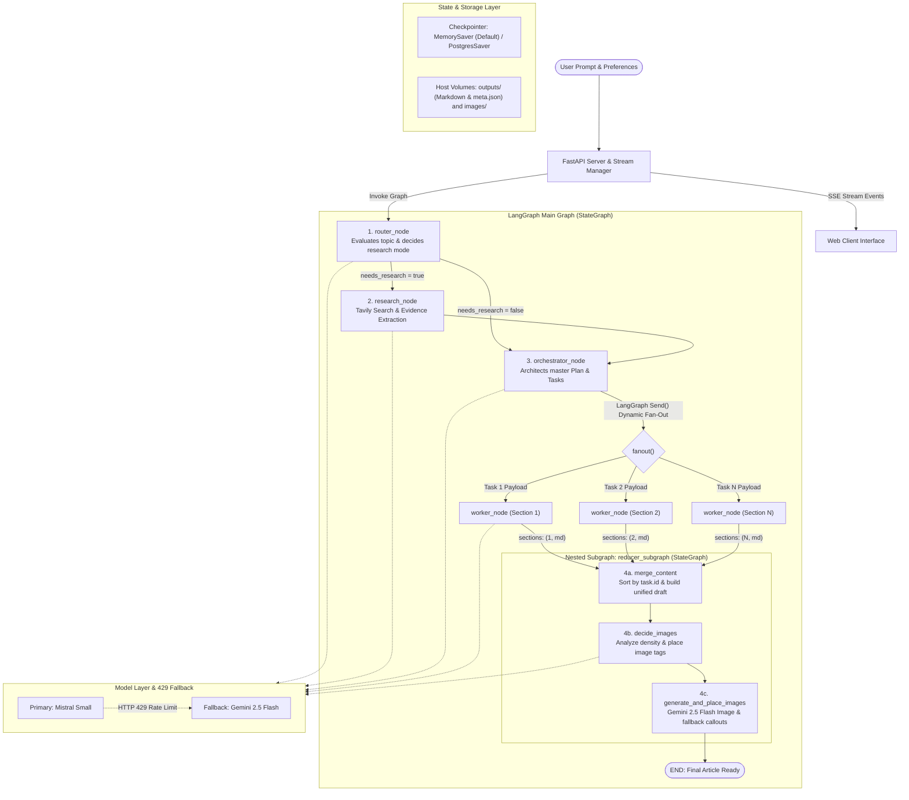

# AgentPress

A multi-agent long-form writing platform that researches, outlines, parallel-drafts, and illustrates essays, analytical articles, and comprehensive writeups across any domain using LangGraph, FastAPI, and Docker.

[Live Deployment](http://ec2-13-235-67-247.ap-south-1.compute.amazonaws.com:8001/) • [Architecture Overview](#architecture-overview) • [Backend Architecture (`backend.py`)](#backend-architecture-backendpy) • [Reducer Subgraph Deep Dive](#reducer-subgraph-deep-dive) • [Data Contracts & Validation](#data-contracts-and-validation) • [Resilience & Fallback](#resilience-and-fault-tolerance) • [Tech Stack](#tech-stack) • [Getting Started](#getting-started-locally)

---

## Live Deployment

The application is deployed and accessible at:

**Live URL:** [http://ec2-13-235-67-247.ap-south-1.compute.amazonaws.com:8001/](http://ec2-13-235-67-247.ap-south-1.compute.amazonaws.com:8001/)

Hosted on an AWS EC2 instance (`ap-south-1`) inside a Docker container, with continuous deployment managed via Amazon ECR and GitHub Actions.

---

## Architecture Overview

AgentPress separates responsibilities across specialized nodes in a LangGraph StateGraph, using dynamic worker fan-out for drafting and an independent compiled subgraph for final reduction, image placement, and synthesis.



---

## Backend Architecture (`backend.py`)

The core execution engine is defined entirely within `backend.py`. It uses LangGraph to manage state, routing, concurrency, and sub-pipeline execution.

### 1. State Definition (`State`)
The state channel uses a Python `TypedDict` for lightweight runtime updates without schema overhead:
```python
class State(TypedDict):
    topic: str
    mode: str
    needs_research: bool
    queries: List[str]
    evidence: List[EvidenceItem]
    plan: Optional[Plan]
    sections: Annotated[List[tuple[int, str]], operator.add]
    merged_md: str
    md_with_placeholders: str
    image_specs: List[dict]
    final: str
```
- **`sections` Channel:** Decorated with `Annotated[..., operator.add]` so parallel workers can asynchronously append section tuples `(task.id, section_markdown)` without state collision or race conditions.
- **`plan` Channel:** Stores the structured editorial blueprint created by the orchestrator.

---

### 2. Execution Flow & Nodes

#### A. Router Node (`router_node`)
- Analyzes the requested topic, audience, and editorial style using `model.with_structured_output(RouterDecision)`.
- Categorizes the execution path:
  - `closed_book`: Conceptual or philosophical subjects where web retrieval is unnecessary.
  - `hybrid`: Foundational subjects requiring fresh real-world examples, recent releases, or benchmarks.
  - `open_book`: Time-sensitive topics (industry news, current pricing, recent events).
- Generates 3 to 8 targeted, time-aware search queries if research is required.
- Dynamic branching via `route_next`:
  ```python
  def route_next(state: State) -> Literal["research", "orchestrator"]:
      return "research" if state.get("needs_research") else "orchestrator"
  ```

#### B. Research Node (`research_node`)
- Queries the Tavily Search API concurrently across all generated queries.
- Normalizes and deduplicates source URLs to prevent redundant citations.
- Extracts structured evidence items using `model.with_structured_output(EvidencePack)`.
- Includes a direct extraction fallback: if structured parsing encounters token constraints, raw search snippets are transformed into `EvidenceItem` records directly.

#### C. Orchestrator Node (`orchestrator_node`)
- Converts evidence and topic requirements into a master `Plan`.
- Breaks the writeup into sequential `Task` objects, assigning each section an evocative heading, a functional role (`hook`, `argument`, `breakdown`, `reflection`), target word count (150–550 words), and concrete narrative bullets.
- Enforces narrative cohesion across the entire article outline before writing begins.

#### D. Parallel Worker Node (`worker_node`) & Fan-Out
- Dispatches sections using LangGraph's dynamic `Send()` API inside `fanout`:
  ```python
  def fanout(state: State):
      plan = state["plan"]
      return [
          Send("worker", {
              "task": task.model_dump(),
              "plan": plan.model_dump(),
              "evidence": [e.model_dump() for e in state.get("evidence", [])],
              "topic": state["topic"],
              "mode": state.get("mode", "closed_book"),
          })
          for task in plan.tasks
      ]
  ```
- Each `worker_node` executes in parallel with access to the global outline, evidence pack, target words, and strict anti-slop prompt guidelines (forbidding generic AI filler words like "delve", "testament", "tapestry", "landscape", "in conclusion").
- Returns `{"sections": [(task.id, section_md)]}`.

---

## Reducer Subgraph Deep Dive

A major feature of `backend.py` is the **Reducer Subgraph** (`reducer_subgraph`). Rather than merging text in a single node, post-processing is modeled as an independent compiled StateGraph mounted directly into the main graph:

```python
# Build the Reducer Subgraph
reducer_graph = StateGraph(State)
reducer_graph.add_node("merge_content", merge_content)
reducer_graph.add_node("decide_images", decide_images)
reducer_graph.add_node("generate_and_place_images", generate_and_place_images)

reducer_graph.add_edge(START, "merge_content")
reducer_graph.add_edge("merge_content", "decide_images")
reducer_graph.add_edge("decide_images", "generate_and_place_images")
reducer_graph.add_edge("generate_and_place_images", END)

reducer_subgraph = reducer_graph.compile()

# Mount into Main Graph
g.add_node("reducer", reducer_subgraph)
```

### Subgraph Pipeline Stages:

1. **`merge_content` (Deterministic Sorting & Assembly)**
   - Reads the accumulated `sections` list of tuples `(task.id, section_markdown)`.
   - Sorts strictly by `task.id`:
     ```python
     ordered_sections = [md for _, md in sorted(state["sections"], key=lambda x: x[0])]
     ```
   - Eliminates out-of-order race conditions from asynchronous workers and prefixes the master title.

2. **`decide_images` (Contextual Visual Planning)**
   - Analyzes the full assembled markdown draft.
   - Emits a structured `GlobalImagePlan` proposing up to 3 high-impact visual assets.
   - Identifies exact contextual paragraphs and injects image placeholder tags (`[[IMAGE_1]]`, `[[IMAGE_2]]`, `[[IMAGE_3]]`) on their own lines.

3. **`generate_and_place_images` (Multimodal Synthesis & Fallback)**
   - Iterates over planned image specifications and calls **Google Gemini 2.5 Flash Image** (`gemini-2.5-flash-image`).
   - Cleans filenames, writes image binaries to `images/<safe_filename>.png`, and substitutes the placeholder tags with markdown image syntax.
   - **Graceful Fallback:** If image generation hits rate limits, invalid credentials, or network errors, automatically injects a styled editorial callout box instead of failing the pipeline:
     ```markdown
     > 🖼️ **[Visual Note]** Caption details...
     >
     > *Alt:* Description of the concept...
     >
     > *Illustration Concept:* Generative visual prompt...
     ```

---

## Data Contracts and Validation

All LLM structured outputs in `backend.py` use strict Pydantic v2 models with custom `@field_validator(mode="before")` pre-processors to prevent schema failures:

- **`Task`:** Represents an individual section. Features `sanitize_bullets` to automatically flatten nested lists or dictionary structures emitted by LLMs into a clean `List[str]`.
- **`Plan`:** The master blueprint containing the title, audience, tone, genre, constraints, and ordered tasks. Features `sanitize_constraints`.
- **`RouterDecision`:** Routing verdict (`needs_research`, `mode`, `queries`). Features `sanitize_queries`.
- **`EvidenceItem` & `EvidencePack`:** Structured search facts containing `title`, `url`, `snippet`, and `published_at`.
- **`ImageSpec` & `GlobalImagePlan`:** Image placement blueprint containing placeholder tags, generative prompts, captions, and size configurations.

---

## Resilience and Fault Tolerance

### 1. Transparent 429 Rate-Limit Fallback
To protect against provider rate limits (`429 Too Many Requests`), `backend.py` uses LangChain's `RunnableWithFallbacks`:
```python
primary_model = init_chat_model("mistralai:mistral-small-latest")

try:
    gemini_fallback = init_chat_model("google_genai:gemini-2.5-flash")
    model = primary_model.with_fallbacks([gemini_fallback])
except Exception:
    model = primary_model
```
If Mistral Small hits rate limits at any stage (router, research extractor, orchestrator, workers, or image planner), execution automatically fails over to Google Gemini 2.5 Flash without throwing an exception or interrupting streaming.

### 2. Dual Checkpointer Architecture
- **MemorySaver (Default):** In-memory checkpointer optimized for real-time FastAPI streaming. Eliminates database connection timeouts, SSL drops, and connection pool exhaustion.
- **PostgresSaver:** Optional persistent checkpointer supported via `psycopg_pool.ConnectionPool` for environments requiring durable checkpoints across server restarts.

### 3. Environment Variable Sanitization
On startup, `backend.py` automatically strips extraneous single quotes, double quotes, and trailing whitespace from API keys loaded via Docker `--env-file`.

---

## Tech Stack

| Layer | Technologies |
| :--- | :--- |
| **Backend Framework** | Python 3.12, FastAPI, Uvicorn |
| **Agent Orchestration** | LangGraph (StateGraph, Nested Subgraphs, Send Fan-Out), LangChain Core |
| **Language Models** | Mistral Small (`mistralai:mistral-small-latest`), Google Gemini 2.5 Flash (`google_genai:gemini-2.5-flash`) |
| **Multimodal Generation** | Google Gemini 2.5 Flash Image (`gemini-2.5-flash-image`) |
| **Search Engine** | Tavily Search API |
| **Data Validation** | Pydantic v2 |
| **State Persistence** | MemorySaver, PostgresSaver (optional via `psycopg_pool`) |
| **Frontend** | Vanilla JavaScript (ES6+), HTML5, CSS3, Marked.js, Highlight.js, DOMPurify |
| **Containerization** | Docker |
| **Cloud Infrastructure** | AWS EC2 (Ubuntu), Amazon Elastic Container Registry (ECR) |
| **CI/CD** | GitHub Actions |

---

## Getting Started Locally

### Prerequisites
- Python 3.12+
- API keys for `MISTRAL_API_KEY`, `GOOGLE_API_KEY` (or `GEMINI_API_KEY`), and `TAVILY_API_KEY`.

### 1. Clone the Repository
```bash
git clone https://github.com/PrathmeshRanjan/AgentPress.git
cd AgentPress
```

### 2. Configure Environment Variables
```bash
cp .env.example .env
```
Populate your API keys inside `.env`:
```env
MISTRAL_API_KEY=your_mistral_api_key
GOOGLE_API_KEY=your_gemini_api_key
TAVILY_API_KEY=your_tavily_api_key
```

### 3. Create Virtual Environment & Install Dependencies
```bash
python3 -m venv .venv
source .venv/bin/activate
pip install --upgrade pip
pip install -r requirements.txt
```

### 4. Run Application
```bash
python app.py
```
Open `http://localhost:8000` in your browser.

---

## Running with Docker

```bash
# Build the Docker image
docker build -t agentpress:latest .

# Run with persistent volume mounts
docker run -d \
  --name agentpress \
  -p 8000:8000 \
  --env-file .env \
  -v $(pwd)/outputs:/app/outputs \
  -v $(pwd)/images:/app/images \
  agentpress:latest
```

---

## API Reference

- **`POST /api/run`**: Starts workflow execution and returns a real-time Server-Sent Events stream of stage updates, section completions, and the final deliverable.
- **`GET /api/history`**: Lists completed writeups indexed from persistent disk storage.
- **`GET /api/runs/{run_id}`**: Retrieves markdown and metadata for a specific writeup.
- **`DELETE /api/runs/{run_id}`**: Deletes a writeup and its local assets from disk.
- **`GET /api/runs/{run_id}/download`**: Direct download of the completed markdown file.
- **`GET /api/health`**: Returns server status and LangGraph compilation state.
